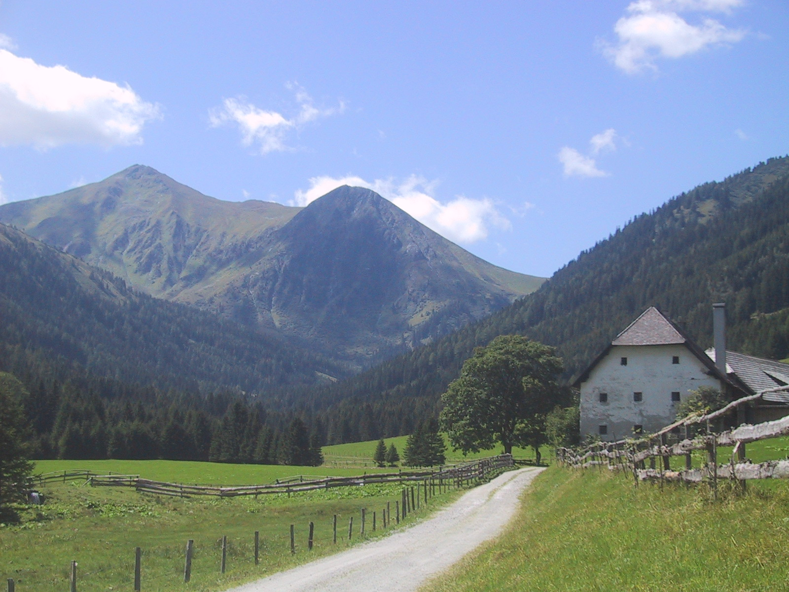

# Images in the banner

An arbitrary image can be inserted in the banner page, as an absolute (possibly relative) reference after the keyword `image:` in the header. The size of the image is scaled to the hight of the banner^[Images which are wide and not high work well, e.g. 1000 by 330 pixel work well.].

The image is in /home/frank/Workspace11/daino/docs/site/dough/Blog/resources/120-2026_IMG.JPG of which `/Blog/resources/120-2026_IMG.JPG` is the part **relative to the `web root`**^[The web root is the directory `dough`]. 

Attention: the file extension is case sensitiv; i.e. "JPG" and "jpg" are different!

# Absolute reference

The image can be references absolutely with `/Blog/resources/120-2026_IMG.JPG`, for example .

<!-- versuch 2: . -->

<!-- todo everywhere the same style for absolute refs -->

# Relative reference

The image can be referenced relatively with `./resources/120-2026_IMG.JPG` as in .

# Considerations

Absolute references remain valid, even when the source for a web pages is moved to another directory. Relative references are useful, if a web page and the images referenced are in a directory and the directory as whole is moved; then the relative relation between reference and referencee remains the same. 

# Image in the margin

The Tufte-style permits images in the margin, inserted as a "footnote". For example^[].

# Image size

The size of an image rendered is by default set to the width of the column it is  set to and adapts to the screen size automatically. 

<!-- todo some hints about formating images and in the margin -->